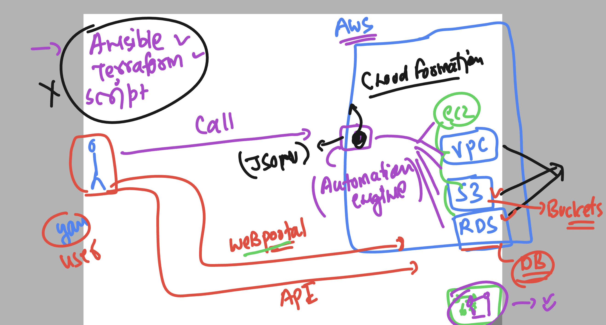
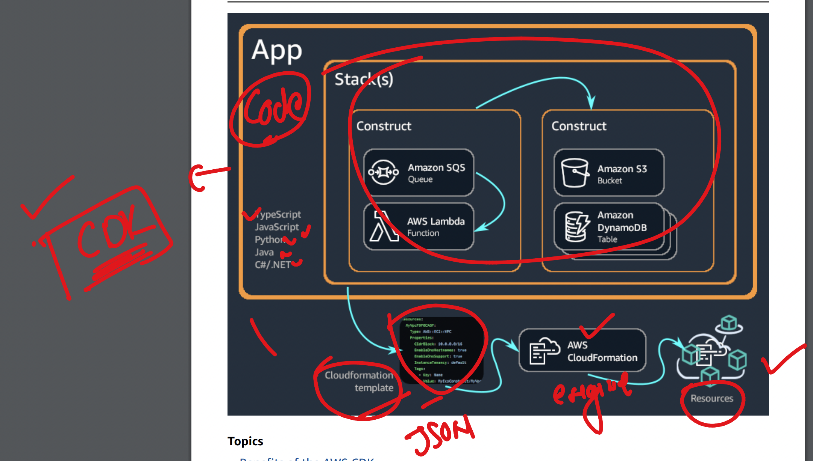
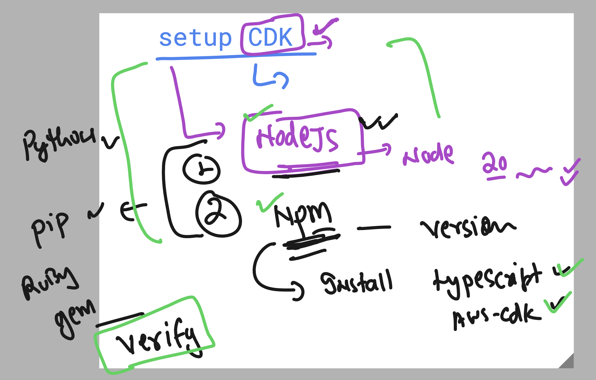
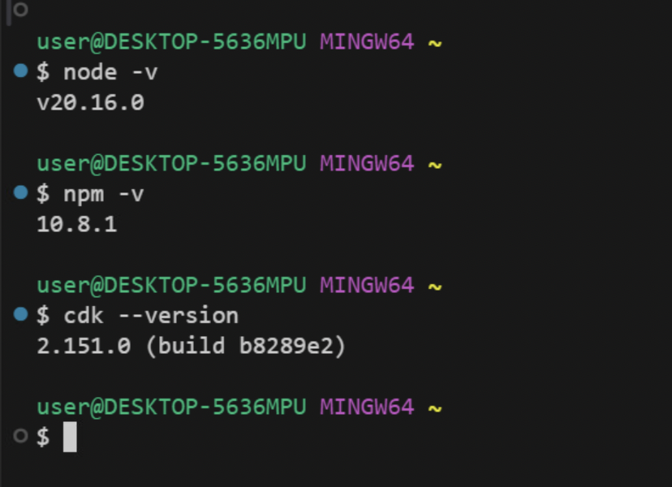
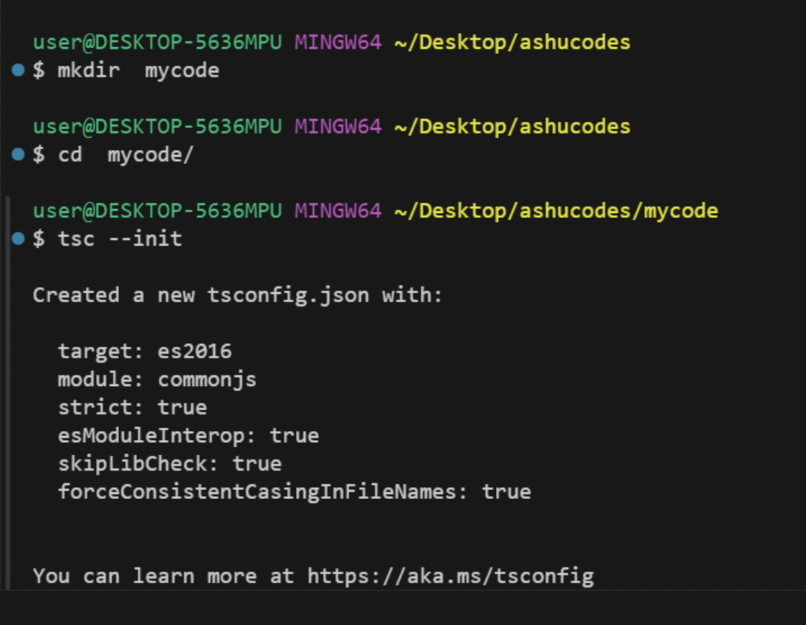
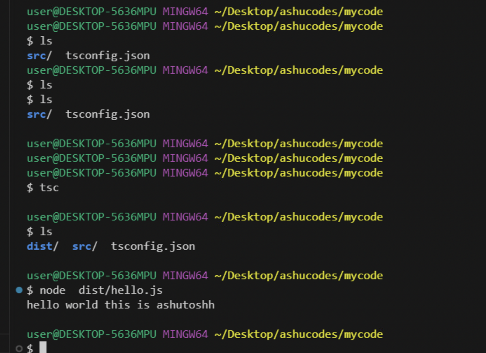
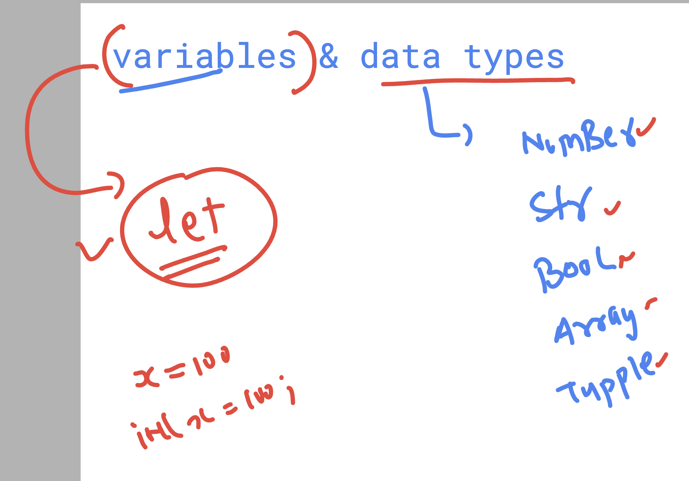
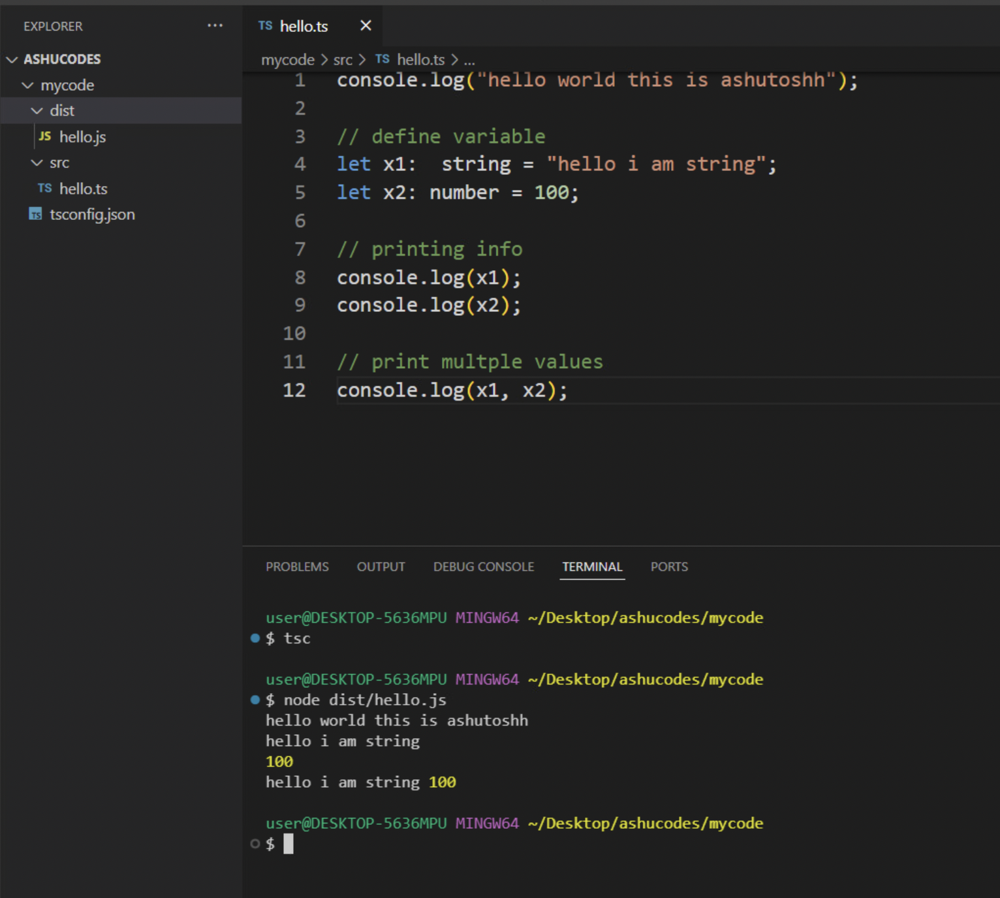

### Intro to aws Cloudformation 

### CDK to Cloudformation engine 

## CDK setup info 

### verify version of node and npm 

### creating  sample tsconfig.json file 

### running your code  of type script 

### Variables and data types 

### code 

