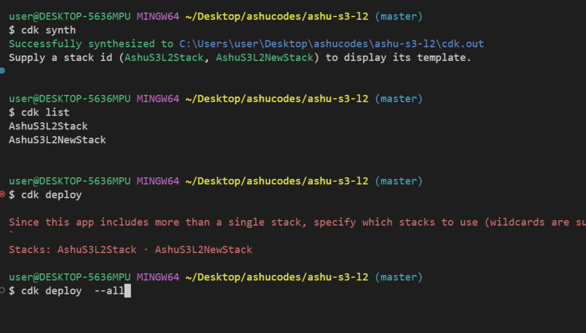

# Revision 

### CDk operations 

### Verify lab connection from CDK machine to aws 

### Cdk Destroy to delete stack and data 

### CDK diff in L2 constructor 

### commands for dealing with multiple stacks 

### Clone git repo to cdk machine 

### pushing local code to github remote repo 

