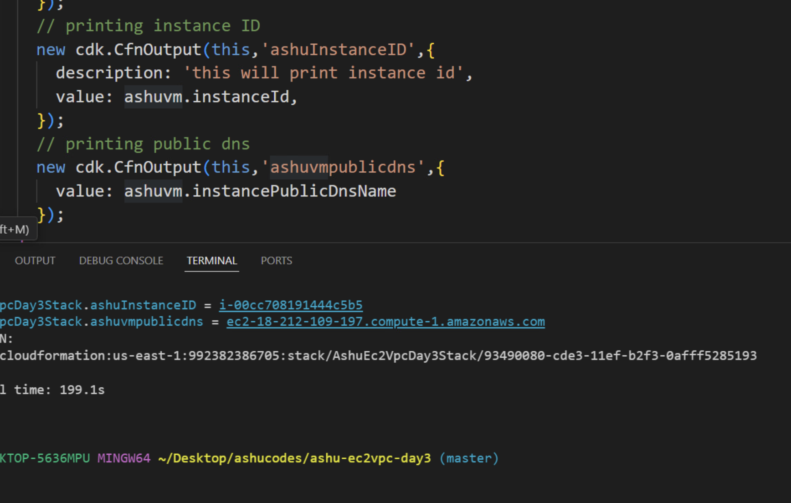
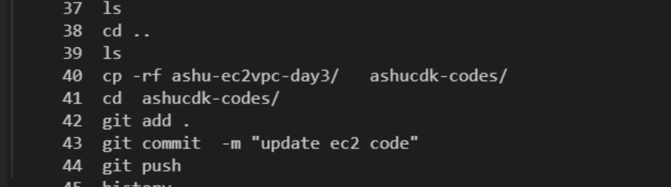
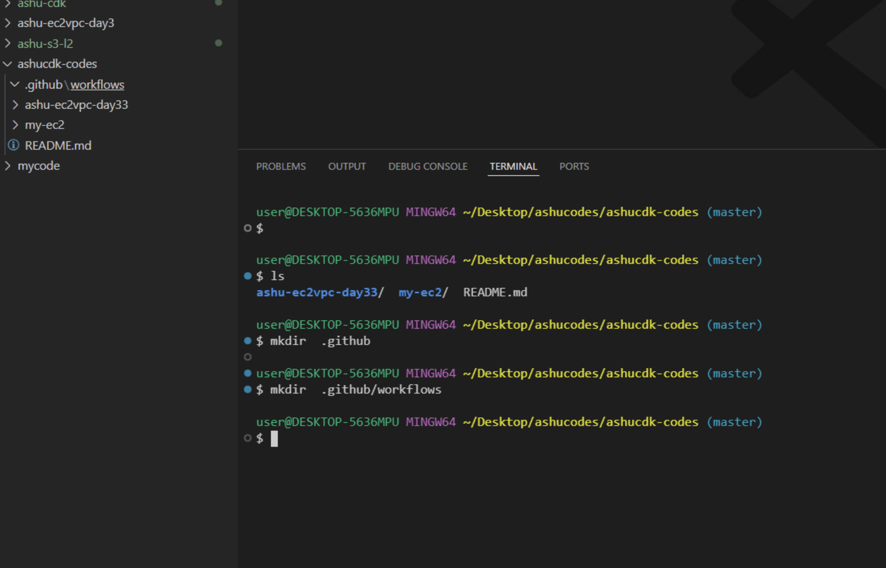

## Revision 

### Do cleanup of ec2 stack from last day 

### bin directory code snap 

### ec2 lib code 

### adding and understanding CfnOutput constructor in cdk 

### copy code to git repo and push it

### creating github workflow directory structure 

